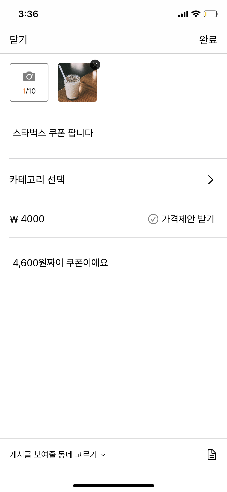
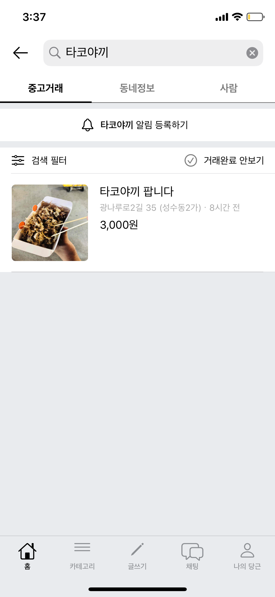
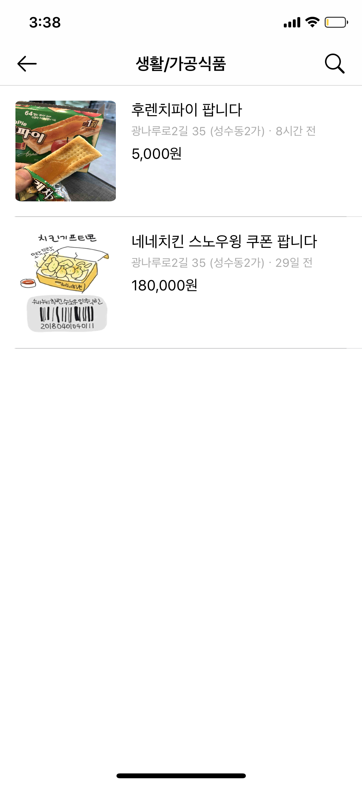
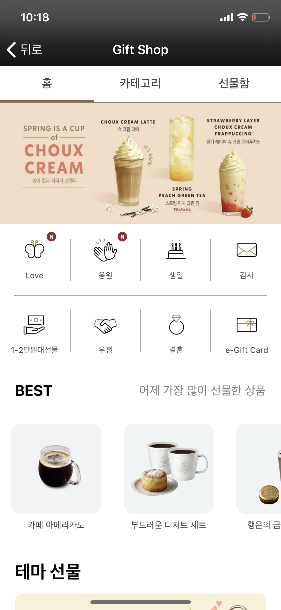
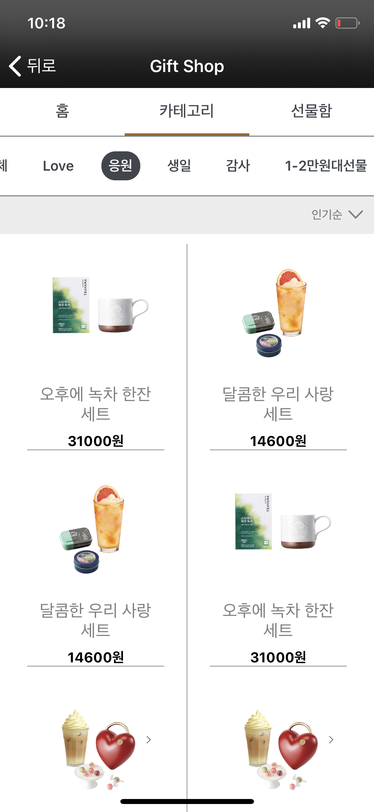
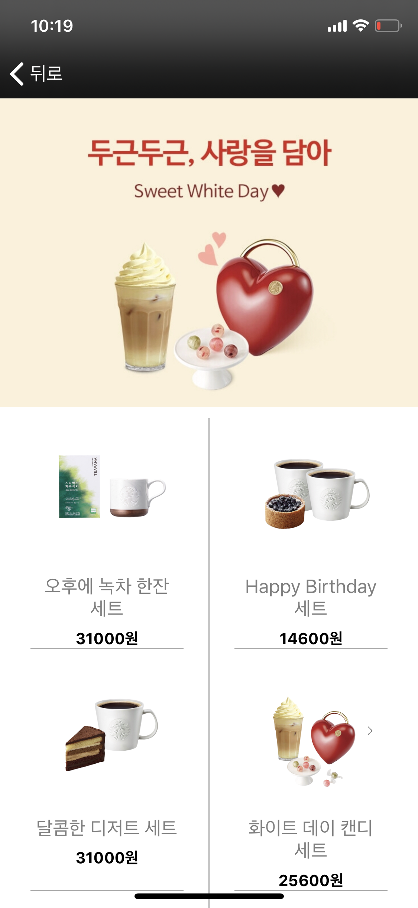

# 박지승 JiseungPark

> 🔹 기획하고 개발하는 걸 좋아하는 iOS 개발자입니다. 

- email: jxsxxng@gmail.com
- github: [github.com/jisng](https://github.com/jisng)

## 목차

- 프로젝트
  - [당근마켓 클론](https://github.com/jisng/resume/blob/master/README.md#%EB%8B%B9%EA%B7%BC%EB%A7%88%EC%BC%93-%ED%81%B4%EB%A1%A0)
  - [스타벅스 클론](https://github.com/jisng/resume/blob/master/README.md#%EC%8A%A4%ED%83%80%EB%B2%85%EC%8A%A4-%ED%81%B4%EB%A1%A0)
  - [두더지 잡기 게임](https://github.com/jisng/resume/blob/master/README.md#%EB%8F%84%EB%8D%94%EC%A7%80---%EB%91%90%EB%8D%94%EC%A7%80-%EC%9E%A1%EA%B8%B0-%EA%B2%8C%EC%9E%84)
  - [가계부](https://github.com/jisng/resume/blob/master/README.md#safemoneylayout---%EA%B0%80%EA%B3%84%EB%B6%80)
  
- 공부이력
  - [패스트캠퍼스 iOS School]([https://github.com/jisng/resume/blob/master/README.md#%EA%B3%B5%EB%B6%80-%EC%9D%B4%EB%A0%A5](https://github.com/jisng/resume/blob/master/README.md#공부-이력))
  
- 경력
  - (2016.03 ~ 2017.05) (주)다노 오프라인 운영팀
  
## 프로젝트

### 🥕 당근마켓 클론

  
  
  

- 개발 기간: 2020.03.20 ~ 2020.04.29 (약 1달)

- 사용 기술:
  - Language: Swift
  - FrameWork: UIKit, CoreLocation
  - Library : Then, Alamofire, SnapKit, KingFisher, SwiftLint
  
- 담당 구현:
  - 글쓰기:
    - 카메라 및 앨범에 접근하여 게시글에 올릴 사진 선택 가능
    - 필수 입력 사항이 충족되지 않으면 게시 불가, 알림창으로 알려줌
    - 게시 버튼 클릭시, 내용 모두 서버에 저장
  - 검색:
    - 텍스트 필드에 글자가 입력 될 때마다 서버에 요청하여 일치하는 키워드 리스트 보여줌
    - 선택한 키워드(검색어)에 일치하는 게시글 리스트 보여줌
  - 카테고리:
    - 선택한 카테고리에 따른 게시글 리스트 보여줌
  - 동네 추가 인증: 
    - 사용자의 현재 위치와 사용자가 선택한 동네 위치 비교
    - 같으면 현재 위치로 동네 인증
    - 다르면 현재 위치 주변의 동네 리스트 보여주고, 선택한 동네로 인증
  
- [더보기](https://github.com/jisng/iOS_DaangnMarket)

### ☕️ 스타벅스 클론

  
  
  

- 개발 기간: (2주)

- 사용 기술:
  - Language: Swift
  - FrameWork: UIKit
  
- 담당 구현: GiftShop
  - 실제 앱과 최대한 유사하도록 UI 
  - 배너 일정 시간 자동 스크롤
  - ScrollView 중첩 사용, 버튼 클릭시 스크롤 
  
- [더보기](https://github.com/jisng/Starbucks-Clone)
### 💥🔨 도더지 - 두더지 잡기 게임

  

- 개발 기간: 2020.02.06 ~ 2020.02.07 (2일)

- 사용 기술:
  - Language: Swift
  - FrameWork: UIKit, UIViewAnimaition, AVAudioPlayer
  
- 담당 구현:
  - 두더지가 랜덤하게 나올 수 있도록 기능 구현
  - 레벨 별 난이도 설정, 난이도에 맞춰 두더지가 나올 수 있도록 구현
  - 게임 종료시 점수 합산, 레벨 별 최고 점수 저장
  
- [더보기](https://github.com/jisng/hackathon-2)

### 💸 Safe.Money.Guide - 가계부

  
  
  

- 개발 기간: 2020.01.17 (1일)

- 사용 기술:
  - Language: Swift
  - FrameWork: UIKit
  - Library: JTAppleCalendar
  
- 담당 구현:
  - 기획
  - 오늘 하루 지출 상태 UI
  - 통계 UI
  - 달력 UI
  
- [더보기](https://github.com/jisng/hackathon-1)

## 공부 이력

- 패스트캠퍼스 iOS School
  - 기간: 2019.11 ~ 2019.04 (6개월)
  - 스쿨 기간동안 [TIL](https://github.com/jisng/TIL)을 정리하며 복습했습니다. 

