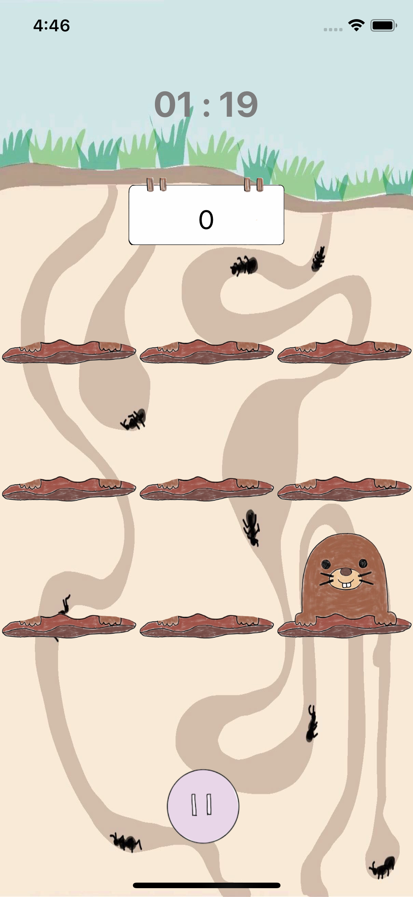
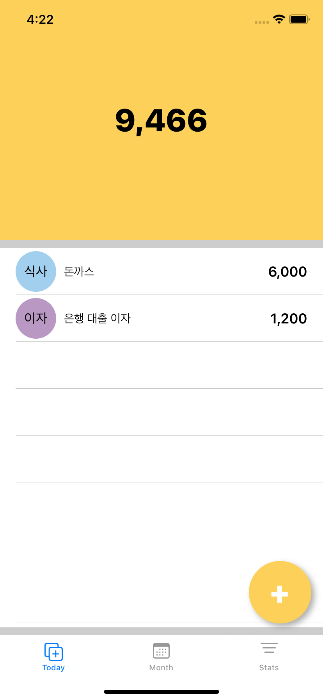
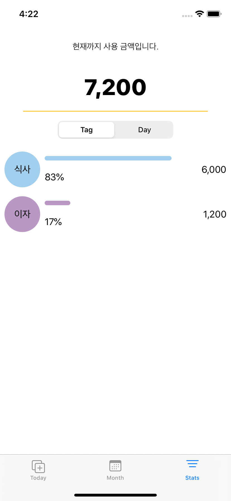

# 박지승 JiseungPark

> 🔹 기획하고 개발하는 걸 좋아하는 iOS 개발자입니다. 

- email: jxsxxng@gmail.com
- github: [github.com/jisng](https://github.com/jisng)

## 목차

- 프로젝트
  - [당근마켓 클론](https://github.com/jisng/resume/blob/master/README.md#%EB%8B%B9%EA%B7%BC%EB%A7%88%EC%BC%93-%ED%81%B4%EB%A1%A0)
  - [스타벅스 클론](https://github.com/jisng/resume/blob/master/README.md#%EC%8A%A4%ED%83%80%EB%B2%85%EC%8A%A4-%ED%81%B4%EB%A1%A0)
  - [두더지 잡기 게임](https://github.com/jisng/resume/blob/master/README.md#%EB%8F%84%EB%8D%94%EC%A7%80---%EB%91%90%EB%8D%94%EC%A7%80-%EC%9E%A1%EA%B8%B0-%EA%B2%8C%EC%9E%84)
  - [가계부](https://github.com/jisng/resume/blob/master/README.md#safemoneylayout---%EA%B0%80%EA%B3%84%EB%B6%80)
  
- 공부이력
  - [패스트캠퍼스 iOS School](https://github.com/jisng/resume/blob/master/README.md#%ED%8C%A8%EC%8A%A4%ED%8A%B8%EC%BA%A0%ED%8D%BC%EC%8A%A4-ios-school)
  
- 경력
  - (2016.03 ~ 2017.05) (주)다노 오프라인 운영팀
  
## 프로젝트

### 당근마켓 클론 🥕

- 개발 기간: 2020.03.20 ~ 2020.04.29(약 1달)

- 사용 기술:
  - Language: Swift
  - FrameWork:  UIKit, CoreLocation
  - Service : FCM, APNs, Firebase Authorization(Phone)
  - Library : Then, Alamofire, SnapKit, KingFisher, SwiftLint
  
- 담당 구현:
  - 글쓰기:
  - 검색:
  - 카테고리:
  - 동네 추가 인증:
  
- [더보기](https://github.com/jisng/iOS_DaangnMarket)

### 스타벅스 클론 ☕️

- 개발 기간: 

- 사용 기술:
  - Language: Swift
  - FrameWork: UIKit
  
- 담당 구현:
  - GiftShop
  
### 도더지 - 두더지 잡기 게임 💥🔨

  

- 개발 기간: 2020.02.06 ~ 2020.02.07(2일)

- 사용 기술:
  - Language: Swift
  - FrameWork: UIKit, UIViewAnimaition, AVAudioPlayer
  
- 담당 구현:
  - 두더지가 랜덤하게 나올 수 있도록 기능 구현
  - 레벨 별 난이도 설정, 난이도에 맞춰 두더지가 나올 수 있도록 구현
  - 게임 종료시 점수 합산, 레벨 별 최고 점수 저장
  
- [더보기](https://github.com/jisng/hackathon-2)

### Safe.Money.Guide - 가계부 💸

  
  
  

- 개발 기간: 2020.01.17(1일)

- 사용 기술:
  - Language: Swift
  - FrameWork: UIKit
  - Library: JTAppleCalendar
  
- 담당 구현:
  - 기획
  - 오늘 하루 지출 상태 UI
  - 통계 UI
  - 달력 UI
  

- [더보기](https://github.com/jisng/hackathon-1)

## 공부 이력

### 패스트캠퍼스 iOS School.

수업을 듣고 [TIL](https://github.com/jisng/TIL)을 정리하며 복습했습니다. 

